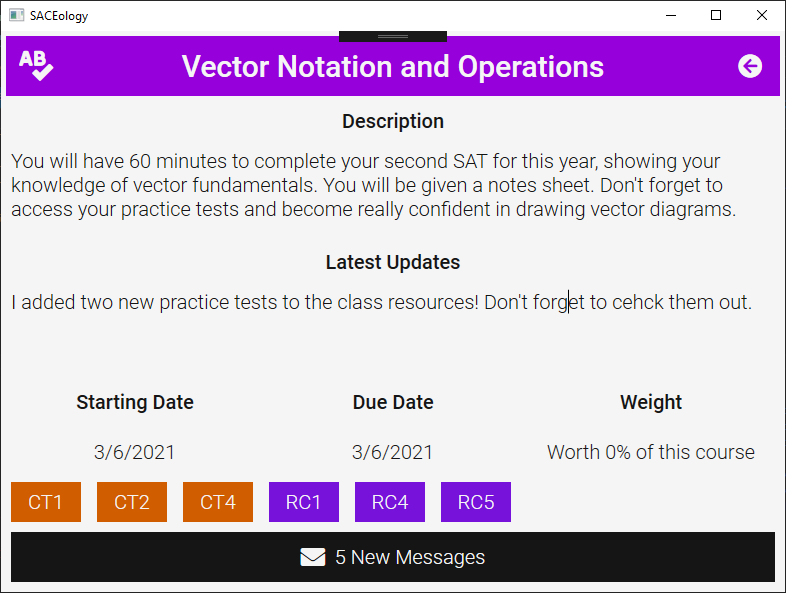
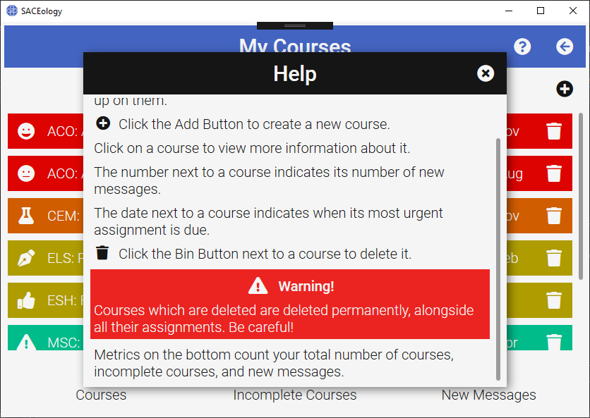
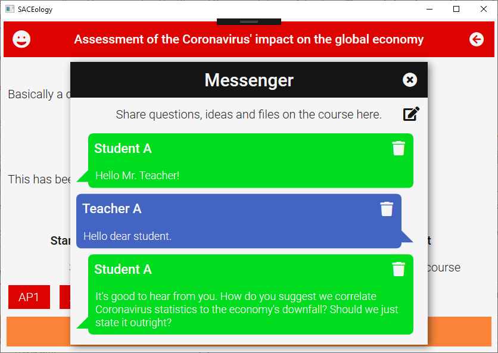

# SACEology

The South Australian Certificate of Education (SACE) can be confusing for teachers and students. However, understanding the SACE is crucial to success in South Australian Secondary Schools. SACEology is a Learning Management System that helps South Australian teachers and students acheive their goals in the SACE.

## Features

SACEology helps teachers by:
- Providing a framework to manage courses and assignments.
- Allowing them to attach documents and audio instructions to assignments.
- Ensuring that their assignments assess their subjects' performance standards.
- Allowing them to directly answer students' questions.
- Allowing them to communicate with other South Australian teachers about their teaching practises.

SACEology helps students by:
- Organising their courses and assignments.
- Allowing them to directly ask their teacher questions.
- Identifying each assignment's performance standards, the criteria in which they are assessed.
- Marking particular assignments with meaningful properties, such as:
  + The most weighted
  + The most varied (in performance standards)
  + The most urgent
  + The shortest (in time)
- Predicting their final Australian Tertiary Admission Rank (ATAR), with bonus points and scaling.
- Predicting their final course grades.
- Estimating the grades required to achieve their goals.

## Development

Learn more about how SACEology was developed [with this video]().

Learn more about how SACEology was designed [with this video]().

## Screenshots

  
  
  
  
  
  
  
  
  
  
  
  
  
  
  
  

